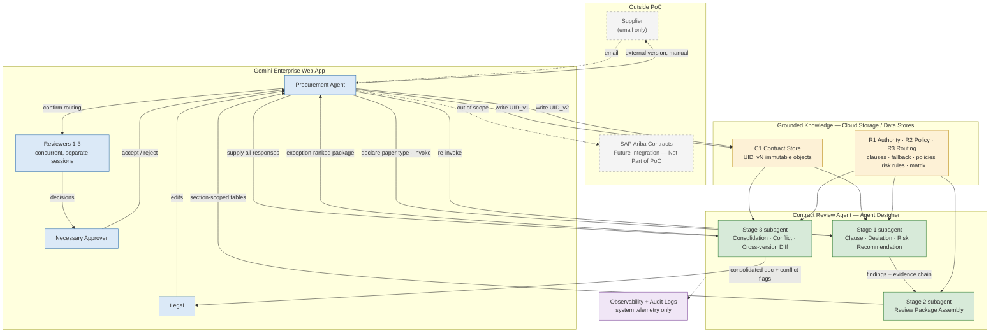

# AI-Powered Contract Lifecycle Management
## Gemini Enterprise PoC — Technical Assessment

**Document status:** Draft for client review
**Basis:** Customer-supplied PoC scope diagram, use-case objectives, and contracting artefacts; validated against Google Cloud / Gemini Enterprise documentation current to 13 August 2026.
**Convention:** Platform claims are tagged **Supported**, **Supported with configuration**, **Requires validation**, **Requires custom development**, **Not evidenced**, or **Out of PoC**. Where evidence is absent, the assessment states *Requires validation* rather than adding architecture to cover the gap.

---

## 1. Executive Summary

### What the PoC will demonstrate

A single Gemini Enterprise agent that performs evidence-based contract review against the customer's approved clause library and contracting policies, producing structured, citable findings and a consolidated review package for the Procurement Agent.

Specifically:

1. **Grounded clause-level analysis** — clause extraction, classification, deviation detection, and policy comparison, where every finding traces to a named contract location and a named governing clause or policy.
2. **Coverage reconciliation** — detection of clauses that are *absent*, not merely those present and modified.
3. **Redline recommendations at levels 1–3** — narrative recommendation, replacement clause proposal drawn from the approved/fallback library, and structured before/after comparison in the comparative-table format the customer selected.
4. **Section-scoped review packages** — one comparative table per reviewer, containing only that reviewer's findings; reviewers with no findings receive nothing.
5. **Attributed consolidation** — reviewer decisions and comments merged into one document with per-reviewer attribution preserved, plus a change cover sheet.
6. **Conflict detection** — divergent reviewer decisions and facially incompatible proposed edits flagged, with each position presented verbatim.
7. **Exception-ranked final package** — unresolved items, conflicts, and evidence gaps surfaced ahead of cleared items.
8. **Honest abstention** — where the supplied material contains no governing authority, the finding reads *Human review required — insufficient policy evidence* rather than an inferred conclusion.

### What the PoC will not demonstrate

| Not demonstrated | Reason |
|---|---|
| In-document editing of the uploaded contract | **Not evidenced.** Canvas edits content generated in the active session; to edit further, content must be exported to another application. |
| MS Word Track Changes or equivalent markup | **Not evidenced** in Gemini Enterprise documentation. Also excluded by the customer. |
| Orchestrated concurrent reviewer workflow (fan-out with automatic join) | **Not evidenced.** Documented construct is a *sequence* of steps including human intervention, not parallel branches. |
| Push notification to reviewers | **Not evidenced.** The customer's own diagram carries three TBDs on this point. |
| CLM version control | Filename convention over immutable objects delivers version-*aware analysis*, not a version graph. |
| Automated conflict resolution | Prohibited by design — the agent detects and presents; humans adjudicate. |
| Automated re-review triggering | No rule set exists in the supplied material. |
| Numeric risk scoring | No scale, weights, or thresholds supplied. |
| External-safe version generation (internal-trace redaction) | Deferred — high consequence, definition not supplied. |
| SAP Ariba integration | Out of PoC. Boundary marker only. |

### The determining factor

**The PoC's demonstrable value is bounded by the completeness of the supplied clause library and policies, not by the platform or the architecture.** With a thin playbook, the correct system behaviour is a high volume of *insufficient policy evidence* classifications. This is the system working as designed and will read as failure unless framed in advance. A playbook coverage assessment is therefore a prerequisite, not a finding.

---

## 2. Current-State Review Process

Reconstructed from the supplied artefact, which is a **target PoC scope diagram with annotations**, not a documented as-is process. Steps are tagged to avoid presenting proposed automation as existing practice.

**Personas (as drawn, none added):** Supplier · Procurement Agent (PA) · Reviewer 1/2/3 · Necessary Approver · Legal.

```text
[AS-IS]     1. Supplier emails contract to PA
[AS-IS]     2. PA loads document — Unique Identifier required     [TBD: UID undefined]
[AS-IS]     3. PA declares paper type: Boeing | Supplier/3rd-party
[PROPOSED]  4. Risk assessment — analyse and assign risks to redlines
[TBD]       5. Reviewers notified                                 [TBD: email vs in-app]
            ── CONCURRENT ────────────────────────────
[AS-IS]     6a/b/c. Reviewers 1–3 review assigned sections
            ──────────────────────────────────────────
[AS-IS]     7. Necessary Approver accepts / rejects
[PROPOSED]  8. AI compiles all changes into 1 single document
[AS-IS]     9. Legal reviews and makes necessary changes
[PROPOSED] 10. Change & conflict review with flagging
[AS-IS]    11. PA reviews final document output
[AS-IS]    12. DECISION: did Legal's changes require reviewer re-review?
                   YES → email to Supplier    NO → internal loop
[AS-IS]    13. PA strips internal traces; sends external version
[OUT]      14. Final doc pushed to Ariba Contracts
```

### Bottlenecks visible in the supplied material

1. **Reviewer discovery is pull-based** — the PoC requires reviewers to prompt the system; notification is an open TBD in three places.
2. **Concurrent reviewers produce conflicting input** with no arbitration step until *Change & conflict review*, five steps downstream.
3. **Manual consolidation** — merging reviewer changes into one document is called out for AI because it is manual today.
4. **Change-visibility gap** — Track Changes is not used, yet the PA requires who-changed-what attribution and a summary *encompassing all versions*. That reconstruction is manual.
5. **Unbounded revision loops** — *"allows for many revisions back through the process."*
6. **No document identity** — the UID is undefined (Sourcing Request #? Contract Workspace? SR+Supplier?), blocking cataloguing, version chaining, and audit.
7. **Audit trail requirement unmet** — *"requires audit trail of negotiations & changes that were ultimately accepted & by who & for what."* Stated as a need; no mechanism drawn.
8. **Manual external redaction** on every outbound turn.
9. **Re-review sequencing is judgment-only** — no rule set governs the decision.

### Effort concentration

PA effort concentrates in four places: **risk assessment against the playbook (step 4)**, **reviewer routing (step 5)**, **consolidation (step 8)**, and **cross-version change reconstruction (steps 10–11)**. These are the PoC's targets.

---

## 3. PoC Scope

### In scope

| # | Capability |
|---|---|
| 1 | PA intake: upload with PA-supplied UID and PA-declared paper type |
| 2 | Grounding on supplied clause library, policies, risk rules, template, responsibility matrix |
| 3 | Clause extraction, classification, coverage reconciliation |
| 4 | Comparison against approved clauses; deviation detection; policy compliance |
| 5 | Risk identification and coarse banding (High / Medium / Low / Not determined) |
| 6 | Redline recommendation — levels 1–3, sourced from the approved/fallback library |
| 7 | Advisory reviewer routing (PA confirms) |
| 8 | Per-reviewer section-scoped comparative-table packages |
| 9 | Reviewer feedback capture with attribution |
| 10 | Consolidation into one document, attribution preserved |
| 11 | Conflict detection and verbatim presentation |
| 12 | Change cover sheet across supplied versions (two-version cap) |
| 13 | Exception-ranked final package for the PA |
| 14 | Re-run after Legal's edits |

### Out of scope

Ariba / S2P / supplier portal integration · supplier access · e-signature · execution · renewals · obligation management · contract analytics platform · numeric risk scoring · automated redline application · automated conflict resolution · automated re-review triggering · external-version redaction · automated loop orchestration · multi-contract-type support · automated data pipelines · Track Changes format · metrics instrumentation.

### Activity classification

| Activity | Classification |
|---|---|
| Supplier email; Ariba push | Out of scope |
| UID assignment; document load; paper-type declaration | PoC — human |
| Clause / deviation / risk / recommendation | **PoC — AI assisted** |
| Reviewer routing | PoC — AI + human review |
| Reviewer review; Approver decision; Legal review | PoC — human |
| Consolidation | **PoC — AI assisted** |
| Change & conflict review; final package | PoC — AI + human review |
| Re-review decision | PoC — human |
| External version | Future phase |

### Must remain human

Accepting, rejecting, or modifying any clause · applying redlines · legal interpretation · resolving reviewer conflicts · deciding whether Legal's changes trigger re-review · sending anything to the supplier · producing the external version · final risk acceptance · filling policy gaps by inference.

### Non-functional boundary

Dev/test environment · synthetic or redacted corpus (real-data conflict **open**) · single contract type · 1 PA + 3 reviewers + 1 approver + 1 Legal · no load, latency, or DR targets · **evidence traceability mandatory — a finding without a resolvable citation is a defect** · reviewer pull model · native web app UI · minimum persistence (contract + reference stores only) · manual out-of-band effort measurement · all artefacts throwaway by default.

---

## 4. Gemini Enterprise Feasibility Matrix

Consolidated. Full evidence and per-requirement configuration detail sit in the Stage 3 validation record.

| Requirement | Platform capability | Status | Key limitation |
|---|---|---|---|
| PA uploads contract | Assistant chat upload | **Supported** | **DOCX capped at 3 MB**; PDF at 100 MB. PDF recommended as primary intake. |
| Durable contract storage | Cloud Storage → unstructured data store | **Supported** | Chat history is not a repository; chats are deleted on an admin-set retention clock keyed to creation date. |
| Clause library / policies as grounded knowledge | Unstructured data store, one-time ingestion | **Supported** | One-time ingestion is GA and ACL-aware; periodic ingestion is Public Preview and does not respect ACLs. |
| DOCX / PDF parsing | Layout parser (default) | **Supported** | Documentation conflicts on DOCX GA vs Preview status — **confirm in tenant**. |
| Scanned documents | OCR parser | **Supported with configuration** | Parses the first 500 pages only. |
| Clause-level retrieval granularity | Layout-aware chunking | **Requires validation** | Chunk size 100–500 tokens; **cannot be changed after data store creation**. |
| Evidence citation | Sources panel | **Supported** | Hovering a source highlights the supported portion of the answer. |
| Clause extraction / classification / deviation / risk | Agent instructions + grounded retrieval | **Requires validation** | No clause-analysis primitive; accuracy is empirical. |
| Reusable playbook rubric | Skills | **Supported with configuration** | GA as of 13 Aug 2026; previously allowlisted. Confirm tenant toggle. |
| Staged reasoning | Multi-step agent with subagents | **Supported** | Orchestration is LLM-driven, not a deterministic DAG. |
| Human review step in a flow | Workflow agents | **Requires validation** | **GA with allowlist**; documentation page is allowlist-gated. Human-step mechanics undocumented publicly. |
| Approval gate on agent actions | Scheduled-execution approval | **Supported** | Gates the agent's actions; not a reviewer task queue. |
| Reviewer pull discovery | Assistant chat + shared agent | **Supported** | Matches the customer's stated PoC decision. |
| Push notification | — | **Not evidenced** | — |
| **Concurrent reviewer orchestration** | — | **Not evidenced** | Documented construct is a sequence. Parallel subagents exist in **Gemini CLI**, a different product. |
| Comparative table output | Assistant tabular output | **Supported** | Exportable to Google Sheets. |
| Review package document | Canvas | **Supported with configuration** | Admin toggle; `alpha` `immersiveArtifacts` IAM permissions via gcloud CLI only; Global/EU/US regions; not on mobile. |
| Export | Canvas export | **Supported** | Docs / DOCX / PDF. |
| Feedback capture | Chat, upload, @mentions | **Supported** | No shared review object; feedback must be re-supplied as input. |
| Consolidation | Agent + Canvas | **Requires validation** | Assembling all reviewer inputs into one context is the unvalidated part. |
| Cross-version change summary | Agent reasoning over versions | **Requires validation** | No diff primitive. Highest-risk element. |
| System audit trail | Cloud Logging usage audit logs; observability GA | **Supported with configuration** | Captures system events, **not** business decisions. |
| Version control | — | **Not evidenced** | Canvas slide updates create a new artifact rather than versioning the existing one. |
| Document editing / Track Changes | — | **Not evidenced** | See §1. |
| Ariba push | — | **Out of PoC** | — |

### Redlining capability, stated precisely

| Level | Capability | Status |
|---|---|---|
| 1. Textual redline recommendation | Grounded narrative recommendation | **Supported** |
| 2. Replacement clause proposal | Language from approved / fallback library | **Supported with configuration** — requires the ladder |
| 3. Structured before/after comparison | Comparative table | **Supported** — the headline artefact |
| 4. Document editing | — | **Not evidenced** for uploaded contracts |
| 5. Track Changes or equivalent | — | **Not evidenced** |

**Consequence:** the redlined document sent to the supplier is produced by a **human** applying accepted recommendations. The PoC does not remove that step.

---

## 5. Recommended Architecture



### Components

| Component | Responsibility | Why required | Service |
|---|---|---|---|
| Gemini Enterprise web app | Single surface for all four personas | Satisfies *"most simple UI possible"* with zero custom development | Gemini Enterprise web app |
| Contract Review Agent (main) | Instructions, pinned model, grounding bindings, stage routing | One agent = one change point, one share scope, one observability target | Agent Designer |
| Stage 1 subagent | Clause, deviation, risk, recommendation | Largest PA effort sink | Agent Designer subagent + Gemini |
| Stage 2 subagent | Review package assembly and filtering | Implements two explicit customer decisions | Agent Designer subagent |
| Stage 3 subagent | Consolidation, conflict, cross-version diff | Second-largest effort sink | Agent Designer subagent |
| C1 Contract Store | Immutable versioned contract objects and feedback tables | Reviewer access; survives chat retention; supplies versions for diffing | Cloud Storage → data store |
| R1 / R2 / R3 Reference Stores | Authority, policy, routing | Principle 4 — no finding without traceable authority | Cloud Storage → data stores |
| Review package output | Inline comparative table + exportable document | *"Download locally… or respond within UI"* | Assistant tables + Canvas |
| Observability & audit | Traces, metrics, usage audit logs | Debugging and system traceability | Cloud Trace / Metrics / Logging |

**Deliberately excluded:** Cloud Run · ADK · custom APIs · Workflows · Pub/Sub · Firestore · Cloud SQL · BigQuery · custom UI · Document AI · A2UI · custom MCP server · second agent identity · notification service · knowledge graph · vector database.

**Store separation is architectural, not cosmetic.** If the contract under review and the approved clause library shared a store, retrieval could return contract text as authority — the agent would compare the contract against itself and report compliance. Separation makes that failure structurally impossible.

---

## 6. Agent Design

**One agent. Three subagents. No second agent.**

A second agent was evaluated for consolidation and rejected: it shares the same grounding, the same model, the same invocation surface, offers no failure isolation, and has no independent reuse. Splitting it would create a hand-off problem the platform does not solve for free, in exchange for no benefit.

**Second-agent trigger (empirical, not pre-emptive):** split Stage 3 only if testing shows that cross-version diff instructions measurably degrade Stage 1 extraction accuracy, or conflict with analysis instructions in a way tuning cannot resolve.

### Staged reasoning flow

```text
A. Receive Contract                    ← Contract Store, {UID}_v{n}
B. Understand Document Structure       ← layout parser output + parse-quality flag
C. Identify Relevant Clauses           ← extract + classify to supplied taxonomy only
D. Coverage Reconciliation             ← expected set vs found set  [required for missing-clause detection]
      ↓ per clause
E. Retrieve Approved Reference         ← R1/R2 only; may return null
F. Compare Contract vs Reference       ← SKIPPED if E returned null
G. Identify Deviation
H. Assess Defined Risk                 ← customer risk rules only
I. Generate Recommendation
      ↓ all clauses processed
J. Prepare Review Package
```

**Stage boundaries are hard.** F cannot execute without E's output. There is no code path from "no authority retrieved" to "deviation identified" — this is the mechanism preventing invented references, not a stylistic instruction.

### Finding schema

```text
Finding ID · Clause · Clause Location · Contract Text (verbatim)
Reference Clause/Policy | Not available · Reference Source (store/doc/section)
Deviation {Absent | Narrowed | Broadened | Reversed | Reworded-equivalent | Added | Not assessable}
Risk Category | Not determined · Risk Level {High|Medium|Low|Not determined}
Reason · Recommended Action {Accept | Negotiate | Escalate | Human review required}
Suggested Redline | None available
Evidence: contract location+quote; authority ref+quote
Reviewer Required | Undetermined · Confidence {High|Medium|Low} · Confidence Basis
```

### Handling rules

| Condition | Disposition |
|---|---|
| Missing clause | `Absent`, propose approved clause. **Only assertable on a clean parse**; otherwise `Possibly absent — parse quality insufficient`. |
| Modified clause | Typed by direction. `Reworded-equivalent` permitted **only** where the fallback ladder sanctions the variant; otherwise `equivalence not established`. |
| Additional clause | `Unmapped`, reference `Not available`, risk `Not determined`, human review. Confidence high as to *novelty*, not as to risk. |
| Ambiguous language | Both readings stated; agent does not select. Undefined terms reported as a fact. |
| Contradictory provisions | Escalate to Legal. **No order-of-precedence applied.** |
| Insufficient policy evidence | `Reference: Not available` / `Decision: Human review required`. No general knowledge, no similar-clause substitution, no policy inferred from precedent. |
| Low-confidence extraction | Confidence `Low` with stated basis (chunk truncation, degraded parse, OCR, table). **Unreviewed page ranges surfaced as a finding.** |
| Unclean mapping | Candidate disclosed for human confirmation; **not treated as retrieved authority**; no deviation or risk computed. |

### Prohibitions

No invented or substituted approved clause · no novel clause language · no risk level without a citable rule · no reasoning from general commercial knowledge where the playbook is silent · no interpreting ambiguity or contradiction · no unsanctioned equivalence · no precedent-as-policy · no enforceability or validity opinions · no suppressed findings · no clean coverage over unparsed regions.

**Failure direction is fixed toward *Human review required*.** A false clean is invisible to the reviewer; a false flag costs a minute.

**Expected consequence:** risk reads `Not determined` in nine of fourteen disposition rows. This is intended behaviour against an incomplete playbook, and must be set as an expectation before the demo.

---

## 7. Contract Review Workflow

```text
 1. Supplier emails contract                        [outside system]
 2. PA writes contract to C1 as {UID}_v1_intake
 3. PA declares paper type                          [human]
 4. PA invokes Stage 1
 5. Stage 1 retrieves contract (C1) + authority (R1/R2)
 6. Findings emitted: contract text | authority | deviation | risk | recommendation
 7. Stage 2 filters by responsibility matrix → per-reviewer packages
 8. PA confirms routing; notifies reviewers         [human; transport out of scope]
 9. Reviewers 1–3 respond                           [human, concurrent]
10. Approver accepts / rejects                      [human]
11. PA writes feedback tables to C1; invokes Stage 3
12. Stage 3 emits consolidated document + conflict flags + change cover sheet
13. Legal reviews and edits                         [human]
14. PA writes {UID}_v2; re-invokes Stage 1 then Stage 3
15. Stage 3 emits exception-ranked final package (cross-version)
16. PA final review; re-review vs send decision     [human]
17. PA produces external version manually           [human — deferred capability]
```

Seventeen steps: **three agent invocations of one agent**; the remainder are human actions or file writes.

**Nine human decision points** — UID/intake · paper type · routing confirmation · reviewer decisions (concurrent) · approver decision · feedback collection · Legal edits · conflict adjudication · re-review and send.

**Evidence retrieval** occurs only inside Stage 1 (and Stage 3 re-read), from C1 and R1/R2. No stage generates a legal position from model knowledge.

**Recommendations** are generated only in Stage 1. **No stage writes to the contract.**

---

## 8. Human Review Model

### Platform limitation, stated plainly

**Gemini Enterprise does not natively support concurrent reviewer orchestration.** There is no documented fork-join, no parallel human assignees, no per-assignee task state, and no completion detection. There is also no shared review object — each reviewer's session is a separate context.

**Smallest workaround, and the whole of it:** concurrency at the human layer, shared state in files. Three reviewers work simultaneously in independent sessions against the shared agent; each returns a completed feedback table; the PA writes them to C1 and invokes consolidation once. No workflow platform, no notification service, no database, no custom code.

From the business's perspective the concurrency is real. It is not orchestrated parallelism and must not be presented as such.

### Four separated layers

| Layer | Author | Mutable by |
|---|---|---|
| AI recommendation | Agent | Nobody — immutable, persists unchanged |
| Reviewer decision | Reviewer | Only that reviewer |
| Reviewer comment | Reviewer | Only that reviewer |
| PA decision | Procurement Agent | Only the PA |

A reviewer rejecting a recommendation does not erase it; the PA overriding a reviewer does not erase the reviewer's position. **All four layers persist side by side — this is what makes the customer's audit requirement (*"by who & for what"*) answerable without a database.**

### Normalized feedback structure

```text
Contract {UID} · Version v{n} · Clause · Finding ID · Reviewer
Reviewer Decision {Accept | Reject | Modify | Defer | Not my scope}
Reviewer Comment · Proposed Change
Status {Open | Answered | Conflicted | Resolved | Escalated} · Timestamp
```

`Not my scope` exists because misrouting is likely with an unvalidated matrix, and silence must never read as assent. `Reject` and `Modify` without a comment are returned as incomplete — an unstated rationale is unconsolidatable.

### Routing

`Clause label + deviation type + risk band → reviewer role`, from the responsibility matrix in R3. **The matrix has not been supplied.** Routing is advisory in all cases; the PA confirms before anything reaches a reviewer. Precedence: explicit clause rule → risk-band rule → paper-type rule → `Undetermined` (routes to PA). If the matrix never arrives, routing drops to manual PA assignment and the demonstrated effort saving reduces accordingly.

### Consolidation flow

```text
Ingest feedback tables → completeness check → join on Finding ID
→ group by finding → classify {Resolved | Conflicted | Escalated}
→ attributed merge → change cover sheet → exception-ranked package
```

Output ordering: Conflicted → Escalated → Unanswered → Resolved-with-changes → Resolved-clean. **Attribution is never anonymised** — the customer requires visibility of who made what change.

### Conflict handling

Two classes: **divergent decisions** (Accept vs Reject on the same finding) and **facially incompatible proposed edits**. Where compatibility is arguable, the classification is `Possible incompatibility — human determination required` rather than a confident conflict call.

Each conflict is presented with: clause reference, the original AI recommendation unchanged, each position **verbatim with attribution**, the governing authority or its absence, and a `Why Unresolved` statement naming the specific playbook silence or the competing authorities.

**Prohibited:** choosing which reviewer is correct · ranking, scoring, or weighting positions · tie-breaking by seniority or ordering · presenting a merged compromise as resolved · treating silence, `Defer`, or `Not my scope` as agreement · **resolving a conflict by falling back to the agent's own original recommendation**.

The last prohibition matters most: the natural failure mode is an agent quietly resolving disagreement in favour of what it recommended initially. That is autonomous adjudication wearing the costume of consistency.

**A conflict where governing authority is `Not available` is a policy gap, not a personality clash.** These should be counted — they identify precisely where the playbook needs writing.

---

## 9. Data and Grounding

### Separation

| Property | Contracts Under Review | Reference Knowledge |
|---|---|---|
| Volatility | New object per version | Static for the PoC |
| Authority | None — the thing judged | The sole basis for judgment |
| If absent | Nothing to review | **Every finding degrades to insufficient policy evidence** |

### Stores

```text
C1  Contracts        gs://{bucket}/contracts/{UID}/
                       {UID}_v1_intake_YYYYMMDD.pdf
                       {UID}_v2_postlegal_YYYYMMDD.pdf
                       {UID}_v{n}_feedback_{reviewer}.xlsx
R1  Authority        approved template · approved clauses ·
                     preferred clauses · fallback ladder
R2  Policy           contracting playbook · procurement policies · risk rules
R3  Routing          reviewer ownership rules
```

Configuration: one-time ingestion (GA, ACL-aware), layout parser, layout-aware chunking. **Note:** blended search across multiple stores is rate-limited in Standard and Frontline editions; unlimited blended search requires Plus. Confirm edition before committing to four stores.

### Data source table

| Data | Purpose | Store | Required? |
|---|---|---|---|
| Contract corpus (single type) | Material under review; parser testing | C1 | **Yes — blocking** |
| Contract versions v1…vn | Change summary; audit trail | C1 | **Yes** |
| Reviewer feedback tables | Consolidation input | C1 | **Yes** |
| Approved contract template | Expected-clause set for coverage reconciliation | R1 | **Yes — blocking** |
| Approved clauses | Primary comparison authority | R1 | **Yes — blocking** |
| Preferred clauses | Ladder position | R1 | Yes, if supplied |
| Fallback clauses | Source of suggested redlines | R1 | **Yes** — else level-2 redlining undemonstrable |
| Contracting playbook | Deviation acceptability | R2 | **Yes — blocking** |
| Procurement policies | Compliance checks | R2 | **Yes** |
| Risk rules | **Only** permitted basis for risk level | R2 | **Yes** — else all risk `Not determined` |
| Reviewer ownership rules | Routing | R3 | No — degrades to manual |
| Historical redlines / approved examples | — | **Not ingested** | **No — recommend exclusion** |
| Review rubric + output schema | Consistency across subagents | Skill or instructions | Optional |

**Historical redlines are deliberately excluded.** They show what was previously *accepted* — precedent, not policy — and cannot support a risk level. Ingesting them buys nothing except retrieval competition with actual authority and a real risk of a past deal being cited as the rule. If required later, they belong in a separate store labelled *Precedent — not policy*, barred from supplying a reference or a risk level.

**Not built:** knowledge graph (clause-to-authority is a lookup, not a traversal) · vector database (native stores suffice; first remedy for recall failure is chunk tuning) · relational database (no demonstrated structured-persistence requirement — findings and feedback are documents joined on Finding ID in one invocation) · Document AI (Principle 7 — only on demonstrated parser insufficiency).

### How grounding prevents unsupported redlines

Grounding alone is insufficient. Four mechanisms together are sufficient:

1. **Retrieval precedes comparison and can return null.** Stage F is skipped when E returns nothing — there is no path from "no authority" to "deviation identified."
2. **The schema permits null and forbids substitution.** `Not available` / `None available` / `Not determined` are legitimate values, so no required field squeezes the model into inventing one. This is where fabrication actually originates.
3. **Store separation makes the wrong source unreachable.** The contract cannot supply authority; precedent is not ingested; reference retrieval is scoped to R1/R2.
4. **Every finding carries a click-checkable citation.** Reference Source names store, document, and section; the Sources panel resolves it. A fabricated reference is falsifiable in one click.

**Residual risk grounding cannot eliminate:** retrieving the *wrong but real* authority. Handled by refusing to treat uncertain mappings as mappings. This is the failure mode to probe hardest — it is the only one producing a confident, evidenced-looking, wrong finding.

---

## 10. Risks and Platform Constraints

**Validated limitations** (documented platform facts) are separated from **architectural assumptions** (our design decisions, falsifiable in testing).

### Validated limitations

| Limitation | Source | PoC handling |
|---|---|---|
| No concurrent reviewer orchestration | Documented construct is a sequence | Human-layer concurrency; PA-mediated collection |
| No push notification primitive | Not evidenced | Manual notification + pull model |
| No document editing / Track Changes | Canvas edits session-generated content only | Redlining levels 1–3 |
| No version control | Canvas slide updates create new artifacts | Filename convention over immutable objects |
| DOCX 3 MB cap | Documented file limits | PDF primary intake |
| OCR 500-page limit | Documented | Unreviewed ranges surfaced as findings |
| Chunk size 100–500 tokens, immutable after creation | Documented | Measured decision before store creation |
| Chat retention keyed to creation date | Documented | Never rely on chat as the record |
| Workflow agents allowlist-gated, docs gated | Release notes | Architecture designed GA-only |
| Audit logs are system telemetry | Documented scope | Business audit trail = four-layer file record |
| Model defaults have migrated repeatedly | Release notes | Pin and record the model |

### Architectural assumptions requiring validation

| Assumption | Impact if wrong | Validation |
|---|---|---|
| Layout parser is sufficient for this corpus | Document AI enters scope | Spike on 3–5 representative contracts |
| Clauses fit within the chunk ceiling with adjacent retrieval | Truncated quotes for the life of the PoC | Measure longest clauses before store creation |
| Correct authority is reliably retrieved | Confident wrong findings | Golden-set retrieval test |
| Cross-version diffing is reliable | Consolidation degrades to per-version lists | Two-version spike |
| PA-mediated collection is workable | Consolidation input incomplete | Test with three real feedback tables |
| Playbook contains enough authority | PoC returns mostly evidence gaps | Coverage assessment before build |

### Blocking issues

**Client-supplied information:** playbook coverage assessment · fallback clause ladder · risk rules · real-data conflict resolved · UID definition · single contract type named.

**Configuration:** corpus inventory and chunk-size decision (irreversible) · model pinned and recorded · feature/IAM/edition/region pre-flight.

**Early validation:** native parsing adequacy · cross-version diffing · retrieval correctness distinguishing "not retrieved" from "not in library."

### Non-blocking limitations to declare before the demo

No orchestrated concurrency · no push notification · no automatic completion detection (the PA checks a list) · PA-mediated feedback collection · advisory matrix-dependent routing · no automated conflict resolution · no automated re-review triggering · version-aware analysis not version control · no cross-clause dependency modelling · redlining levels 1–3 only · external version deferred · no numeric risk scoring · two-version diff cap · Canvas not on mobile · manual out-of-band measurement.

### Additional risks worth naming

- **Cross-clause dependencies** — clause-by-clause analysis misses interactions (an LoL cap read without the indemnity carve-out). Accepted as a PoC limitation; internal contradictions *are* detected.
- **False positives vs false negatives** — weighted asymmetrically by design. If the business owner sets one threshold, it should be on missed deviations.
- **Prompt injection via contract text** — the contract is untrusted input containing natural language. Model Armor is available; one adversarial test case recommended.

### Feasibility conclusion

**Feasible.** The architecture is small, wholly within GA capability, and requires no custom code. Nothing in the technical analysis threatens the PoC. What threatens it is playbook completeness, which no architecture repairs.

---

## 11. PoC Evaluation

**No thresholds are invented.** The customer supplied none; every target reads *To be agreed with business owner*. **Baselines must be elicited before first use** — once the PA has used the tool, the memory of manual effort is contaminated.

### Evaluation dataset

10–15 contracts from the supplied pool, selected to exercise specific risks: clean Boeing paper · modified Boeing paper · 3rd-party paper · known missing clauses · known additional clauses · clauses at the chunk ceiling · table/exhibit obligations · scanned (if present) · known internal contradiction · clause with no governing policy · one adversarial embedded-instruction case.

Ground truth labelled by a person who knows the playbook, before any agent runs. Entries for `none exists` and `not determinable` are as important as positive labels — without them, retrieval failure is indistinguishable from a genuine policy gap. **Effort: one labeller, 2–3 days. That is the entire evaluation infrastructure.**

### Metrics

| Category | Metrics | Target |
|---|---|---|
| **Clause identification** | Expected coverage · missing-clause detection · **false absence (separate)** · extraction verbatim correctness · truncation rate · classification correctness · **force-fit rate** | To be agreed with business owner |
| **Deviation detection** | Correct identification and typing · type-only error rate · **missed deviations** · **false-positive rate** · contradiction detection | To be agreed with business owner |
| **Risk assessment** | Band agreement with reviewers · direction of disagreement · adjacent vs severe · `Not determined` rate · **`Not determined` correctness** | To be agreed with business owner |
| **Redline recommendation** | Acceptance · modification · rejection · **directional usefulness (Accept+Modify)** · redline availability | To be agreed with business owner |
| **Review efficiency** | PA effort per contract · total review time · time locating clauses · time identifying deviations · **time consolidating feedback** · time reconstructing cross-version changes · reviewer time · **residual manual effort** | To be agreed with business owner |
| **Grounding** | **Material recommendations with an identifiable approved source** · wrong-authority rate | To be agreed with business owner |

### Design constraints — not negotiable targets

Any non-zero count is a defect to fix, not a number to report: unresolvable citations · novel redline language · unsanctioned equivalence assertions · risk levels without a citable rule · contract-as-authority incidents · precedent-as-policy incidents.

Mixing these into a single grounding score would let a fabrication average out against ninety correct citations.

### Two metrics worth particular attention

- **`Not determined` correctness** — distinguishes honest abstention from broken retrieval. A high abstention rate with high correctness means the system is behaving well against a thin playbook; with low correctness it means retrieval is broken. These look identical from the output alone.
- **Residual manual effort** — a PoC reporting only savings while omitting the manual steps it introduces is misleading, and the PA will notice within a week of production use.

### Run protocol

Record per run: pinned model + version · run date · instruction version · data store IDs and ingestion date · chunk size and parser config · Skill version. **Without the model pin, a second run is not comparable and regression is undetectable.** Two runs — baseline, tune, compare. A third suggests a grounding problem rather than a prompt problem.

### Not measurable in this PoC

Statistical significance (12 contracts — directional only) · production accuracy (synthetic corpus, dev tier, single type) · throughput · reviewer adoption over time · redlining levels 4–5 · concurrency performance.

### Open items blocking evaluation

Metrics-exclusion conflict confirmed · baselines elicited before first use · targets set by the business owner · ground-truth labeller identified · real-data conflict resolved.

---

## 12. Implementation Roadmap

No calendar durations — staffing and delivery constraints not provided. Sequence and dependencies only.

| Increment | Deliverable | Dependency | Acceptance evidence |
|---|---|---|---|
| **0. Environment Readiness** | App provisioned; edition/region/quota confirmed; toggles enabled (Agent Designer, Canvas, Skills); Canvas alpha IAM applied if custom roles used; model pinned; observability + audit logging on; workflow-agent allowlist requested | Cloud project; admin access | Feature-management state captured; model + version recorded; test prompt returns a grounded answer |
| **1. Contract Corpus Preparation** | Corpus inventory; real-data conflict resolved; contract type named; UID convention defined; evaluation set selected | Client corpus; blocking items closed | Inventory table; named type; UID convention; evaluation set mapped to slices |
| **1a. SPIKE — Parsing adequacy** | Layout-parser assessment on 3–5 contracts incl. worst structural case | 1 | Written verdict. **Document AI enters scope only on insufficiency** |
| **1b. SPIKE — Clause boundary / chunking** | Longest clauses measured; chunk size and retrieval settings decided | 1 | Recorded decision. **Gate: chunking immutable after store creation** |
| **2. Grounding Setup** | C1, R1, R2, R3 (if matrix); one-time ingestion; layout parser; layout-aware chunking; precedent excluded | 1a, 1b; client artefacts | Stores Active; golden-set retrieval test passes; "not retrieved" vs "not in library" distinguishable |
| **2a. Playbook coverage assessment** | Count of corpus clauses with governing authority | 2 | Coverage figure reported. **Scope reopens if low** |
| **3. Contract Review Agent (shell)** | Main agent: instructions, pinned model, store bindings, share scope; optional Skill | 0, 2 | Agent created (not Draft); Preview returns grounded cited response; Sources resolve |
| **4. Clause / Deviation Analysis** | Stage 1 subagent, full schema, all eight handling rules | 3 | Findings in schema on 3 contracts; null values fire correctly; zero unresolvable citations; zero contract-as-authority incidents |
| **5. Redline Recommendations** | Levels 1–3 from approved/fallback ladder | 4; ladder supplied | Redlines traceable to library; **zero novel-language incidents**; `None available` where ladder silent |
| **6. Human Review** | Stage 2 subagent; per-reviewer packages; three-band ordering; feedback structure; pull query; export | 5; R3 if in scope | Three distinct packages from one contract; zero-finding reviewer receives nothing; pull query answers; DOCX + Sheets export |
| **6a. SPIKE — Cross-version diff** | Two-version diff and change cover sheet | 4 | Written verdict: reliable / degraded fallback. Gates increment 7 scope |
| **7. Feedback Consolidation** | Stage 3 subagent: completeness, join, grouping, conflict classification, attributed merge, cover sheet, exception-ranked package | 6, 6a; three feedback tables | Conflicts flagged; verbatim attributed positions; **zero autonomous adjudications**; unanswered routed to PA |
| **8. Evaluation** | Ground truth labelled; baselines elicited **before first PA use**; two runs with metadata; results across all six categories | 4–7; labeller; agreed targets | Results table; design-constraint metrics at zero; residual manual effort reported |
| **9. PoC Demonstration** | End-to-end walkthrough; limitations stated in writing **before** the demo | 8 | Client sign-off; limitations acknowledged; production recommendation |

### Must have

Increments 0–4, 6, 7 plus spikes 1a, 1b, 6a and coverage assessment 2a.

### Nice to have if time permits

Reviewer routing (R3) · playbook as a Skill · level-2 suggested redlines (ladder-dependent) · Canvas-formatted package · prompt-injection test · workflow agents replacing PA-mediated triggering if the allowlist clears and validates.

### Explicitly deferred — not to be reintroduced into the core architecture

Ariba integration · supplier access · e-signature · execution · renewals · obligation management · contract analytics · numeric risk scoring · in-document editing and Track Changes · automated conflict resolution · automated re-review triggering · external-version redaction · automated loop orchestration · push notification · shared live review state (custom MCP) · CLM version control · multi-contract-type support · Document AI (unless 1a fails) · instrumented metrics.

---

## 13. Future Expansion

Identified for target-state planning. **Not designed here.**

| Area | Note |
|---|---|
| SAP Ariba integration | Future integration boundary. APIs under validation by Ariba IT. Not designed. |
| Broader contract analytics | Portfolio-level deviation and risk trends. |
| Enterprise contract governance | Obligation management, renewals, policy compliance reporting. |
| Additional contract categories | Beyond the single PoC contract type. |
| Additional business units | Multi-tenant grounding and routing. |
| Production orchestration | Workflow agents post-validation, or ADK for genuine fan-out, joins, timeouts, and re-review loops. |
| Shared review state | Custom MCP server or datastore replacing PA-mediated file collection. |
| Notification | Gmail / Slack / Teams actions for push and reminders. |
| Real versioning and business audit store | Version graph with lineage; queryable decision/actor/rationale/timestamp records. |
| Deterministic diffing | If model-based cross-version reasoning proves insufficient at scale. |
| Legal DMS grounding | iManage / NetDocuments / Docusign connectors — currently Public Preview. |
| Automated external-version redaction | High consequence; requires its own validation. |
| Production security | Production identity, VPC Service Controls, CMEK, Model Armor policy, retention policy. |

---

## Appendix — Open Items for Client Decision

| # | Item | Blocks |
|---|---|---|
| 1 | Playbook coverage — how many corpus clauses have governing authority | Whether the PoC can demonstrate anything |
| 2 | Fallback clause ladder supplied? | Level-2 redlining |
| 3 | Risk rules supplied? | All risk levels |
| 4 | Reviewer responsibility matrix supplied? | Routing (degrades to manual) |
| 5 | Real vs synthetic/redacted corpus — diagram excludes real data, corpus is primary evidence | Ingestion; evaluation representativeness |
| 6 | Unique Identifier definition (SR#? Contract Workspace? composite?) | Versioning, feedback joins, diffing |
| 7 | The single contract type — decided but never named | Template baseline |
| 8 | Metrics exclusion vs measurable-reduction objective — is out-of-band manual timing acceptable? | Evaluation |
| 9 | Evaluation targets for all six categories | Evaluation |
| 10 | Ground-truth labeller (2–3 days, playbook knowledge) | Evaluation |
| 11 | Workflow-agent allowlist — pursue in parallel? | Optional upgrade path only |
| 12 | Gemini Enterprise edition (blended-search limits) and region | Store design; Canvas availability |
| 13 | Change-representation format substituting for Track Changes | Consolidation output design |
| 14 | Audit trail scope and retention depth | Persistence design |
| 15 | NO-branch re-entry point in the supplied diagram (unreadable) | Loop handling (deferred in PoC) |
